# -Mastering-Data-Cleaning-in-Microsoft-Power-BI-Step-by-Step-Guide-
Explore step-by-step instructions, best practices, and hands-on examples to transform raw data into clean, structured insights using the powerful tools and features of Microsoft Power BI. Whether you're a beginner or an experienced user, this repository empowers you to enhance your data quality.

## Introduction
This repository provides comprehensive information for becoming a Power BI data cleaning expert. The step-by-step guide will explain how to turn messy, raw data into clean, accurate and ready-to-analyze datasets. If you're new to data cleaning or a seasoned pro, this repository will provide you with the skills you need to confidently tackle data cleaning challenges.

## Problem Statement
Data cleaning is a critical phase in the data analysis process, but it can be time-consuming and challenging. Messy datasets, missing values, inconsistencies, and formatting issues can hinder accurate insights. With this project, we will provide a systematic approach to cleaning data within Microsoft Power BI. From handling missing data to standardizing formats, you'll learn how to effectively deal with common data quality issues.

## Analysis:
In this repository, we'll cover a wide range of data-cleaning techniques using Microsoft Power BI's capabilities. You'll discover how to:
1. Identify and handle missing data using various methods like imputation and removal.
2. Deal with inconsistencies in categorical data through grouping and renaming.
3. Detect and handle duplicate records to ensure data accuracy.
4. Transform and reshape data structures to fit your analytical needs.

The following steps are used to load clean files into the Power BI Desktop. Note, that we can import various types of data files into Power BI.  We are just going to use a .csv file first.  

1. Open your Microsoft Power Desktop.

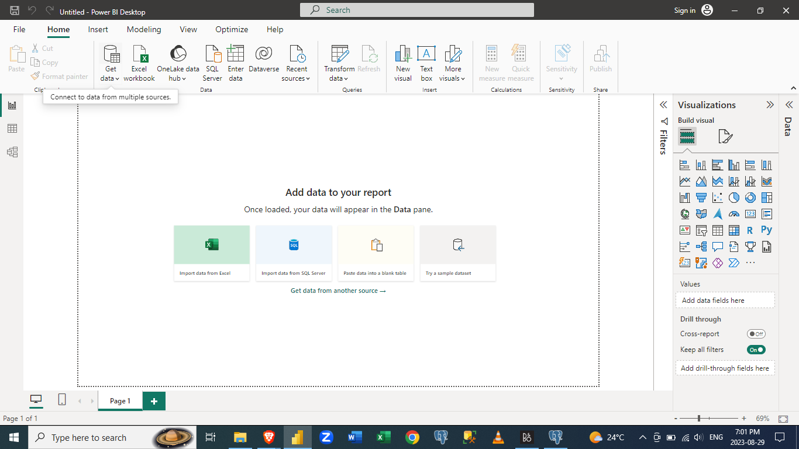

2. Then click on Get Data, then this dialogue box appears.

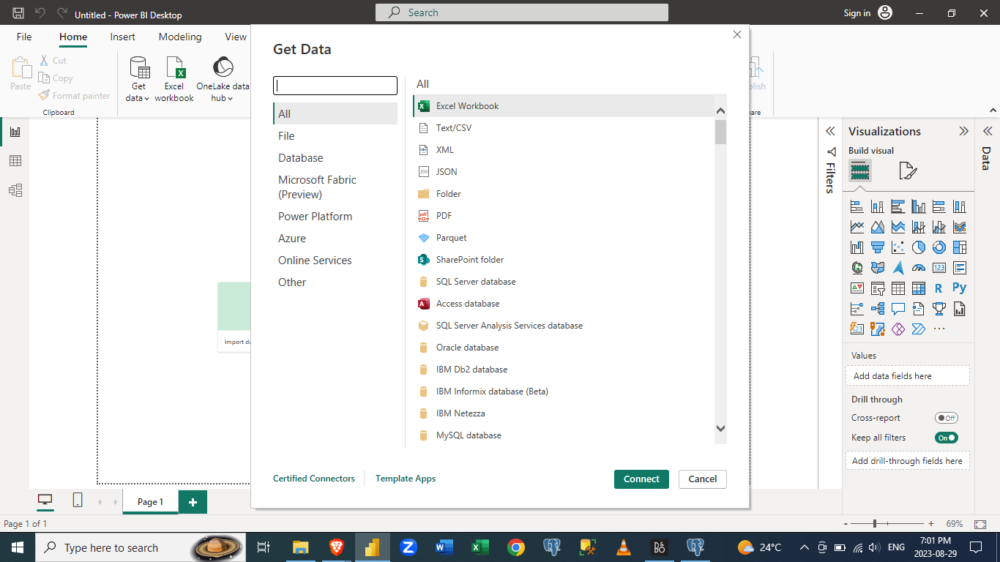

3. The Employee.csv file is loaded into the desktop.

4. Change the data types of the columns. Any column that is not needed for analysis can be converted to text.

5. In The date of birth column, as you can see the values are not correctly written. We have to clean the column first.  
To do that,
a. We click on the Transform Tab  
b. Then, Click on Replace Values  
c. Replace the delimiter with the delimiter you want to replace it with  

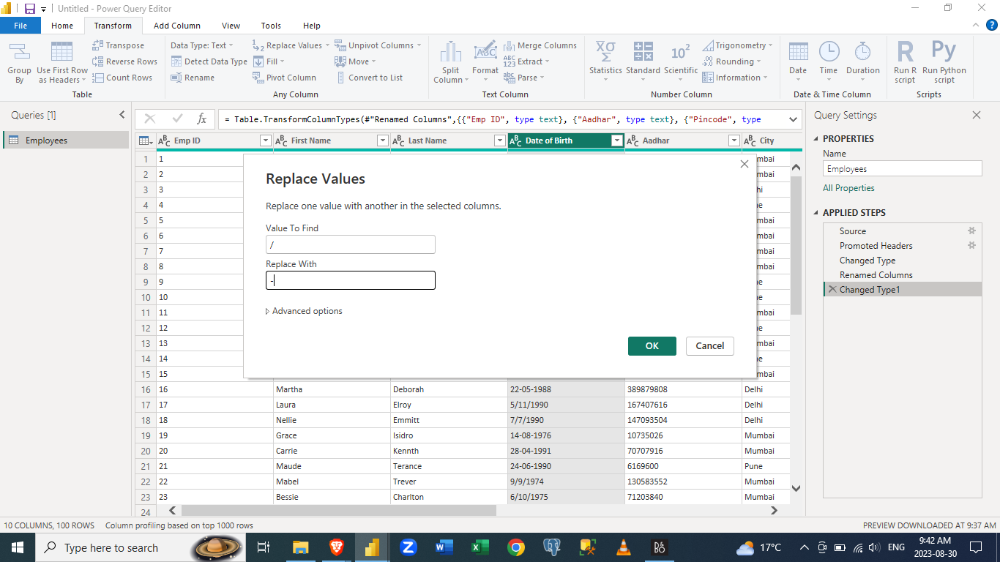

6. The date of birth column delimiter has been standardized all through the column

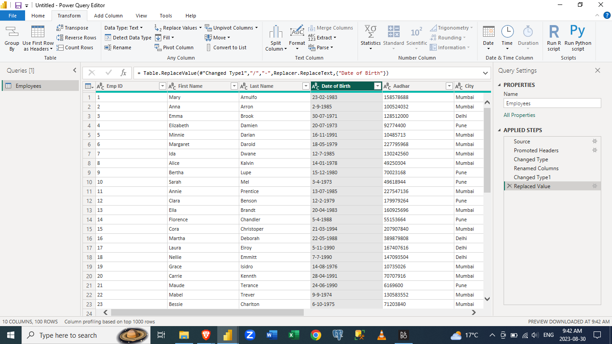

7. Some in the date column still return an error when you convert to date data type.  
You have to split the date column by delimiter which splits the date column into 3 new columns

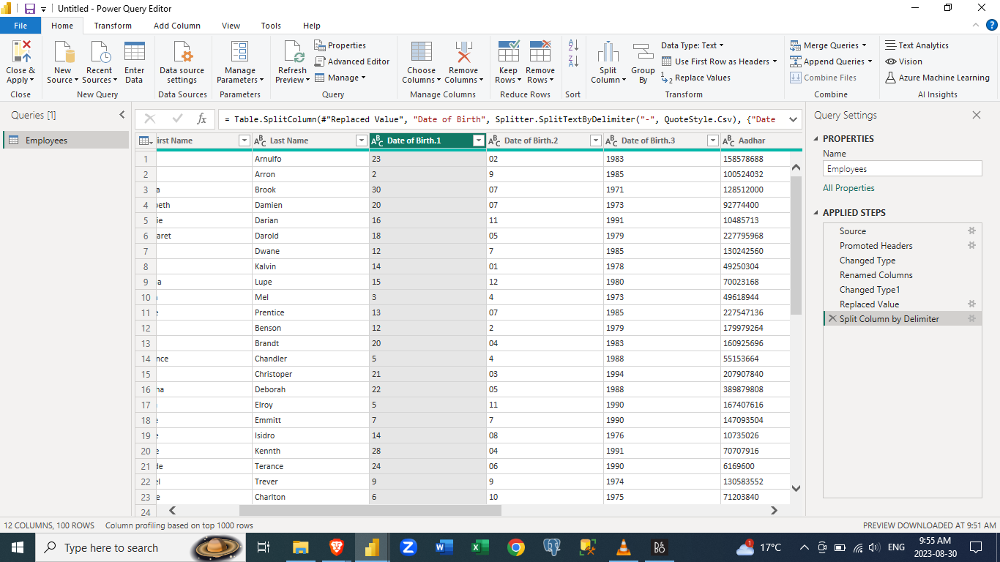

8. Select the year, month and day columns, then right-click on any of the three(3) selected columns, Then select Merge columns

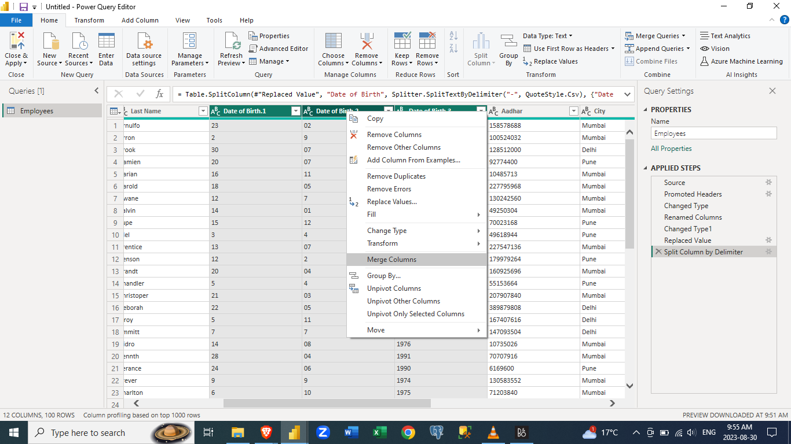

9. a.Choose your desired separator, if it is not available in the option,  
   b. Then select Custom, then input your desired separator  
   c. Choose a new column name as desired.  
   d. Then click OK.

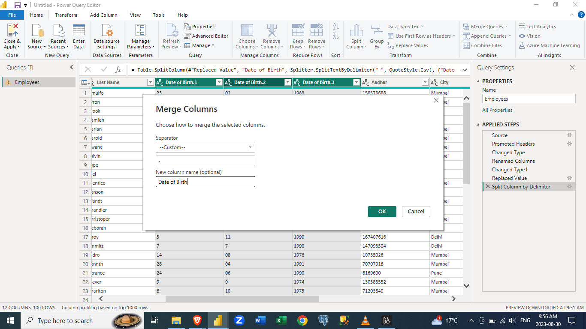

10. Now you can change the data type of Date of Birth column to Date and this time we do not get any error on the rows

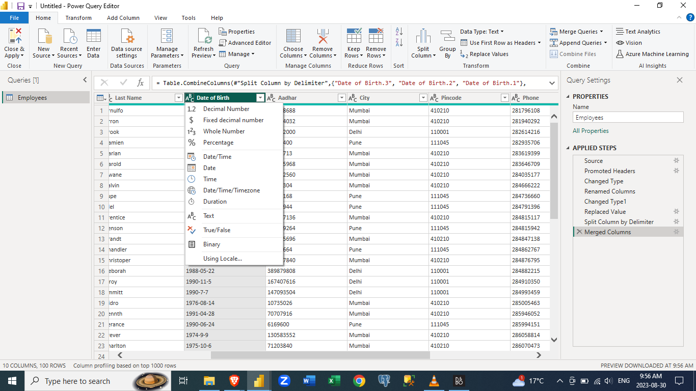                                            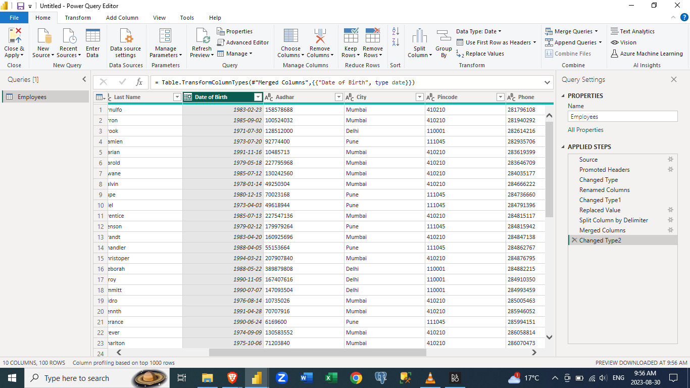

11. Now, import the Department.csv file into the power query.  

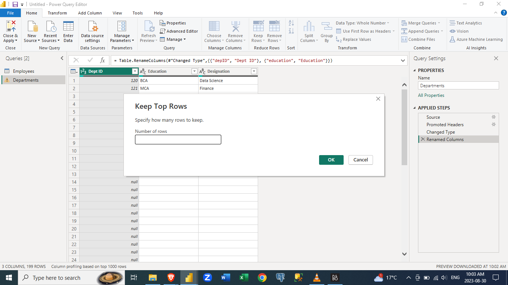

As you see the file comes with empty/null rows. We have to get rid of the empty rows.
You can either keep or remove rows. We choose to Keep rows

We keep the first 11 rows which contain values

Now we merge the Employee table with the Department table.  

12. Click down on Merge Queries, then select Merge Queries as new

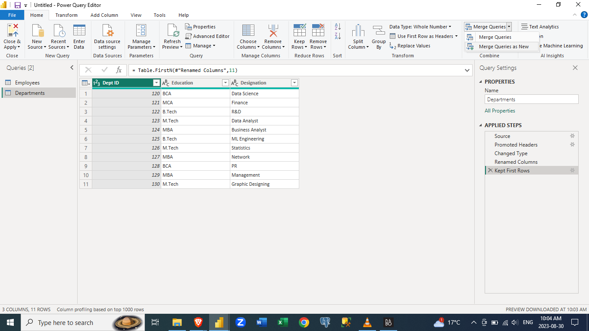

13. a. Select the table you want another table to be joined to. In this case, Employee 
       show as our main and first table and then the Department table as the second 
       table.  
    b. Choose the Join Kind, In this case, we choose the Left Outer Join which returns 
       all the columns from the left table alongside columns from the right column.  
    c. Click OK.

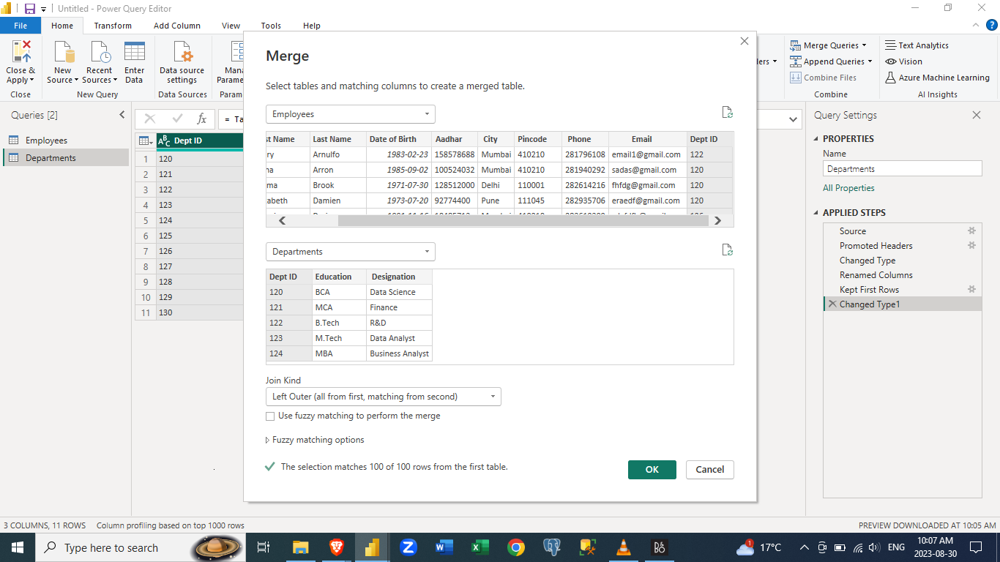

14. The two tables are merged. Now you have to expand the newly merged table.

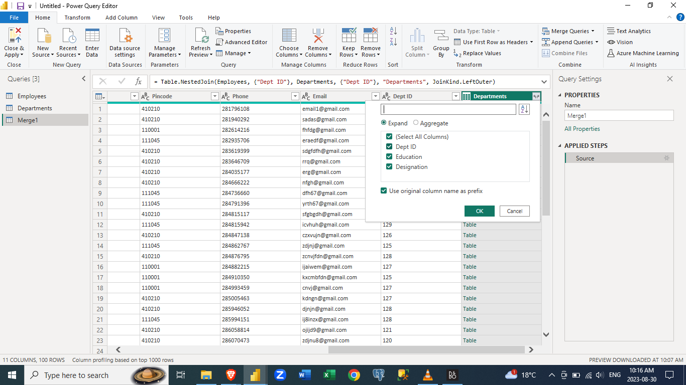

15. The table is now expanded and then the matching column from the new table is removed so as not to have 2 matching columns in the new table.

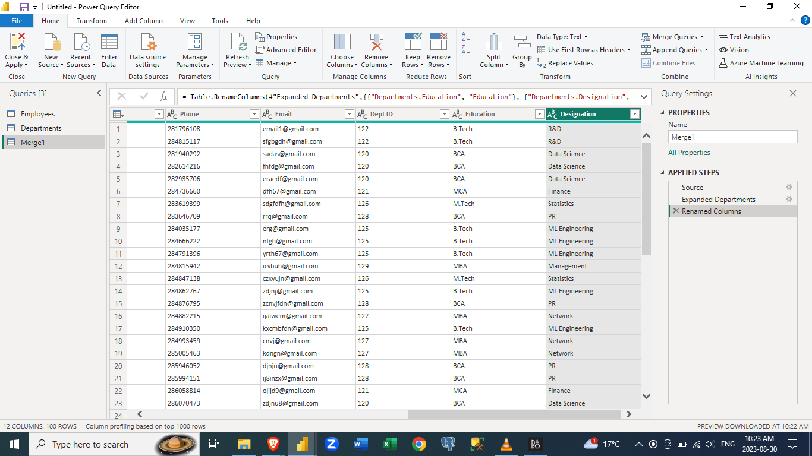

16. Import a file into the Power Query Editor. We are importing the salary.csv file into the Power Query Editor.

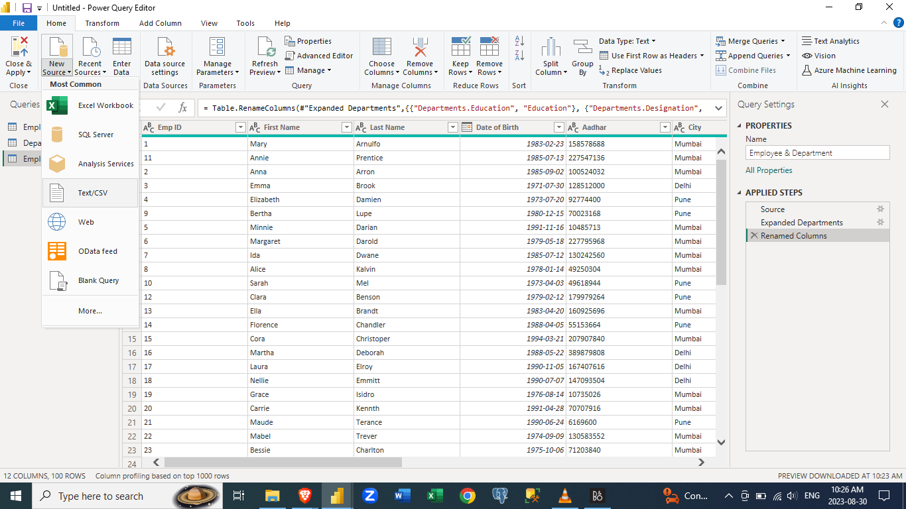

17. The salary.csv file is now imported into the Power Query Editor.

18. We are going to Merge Queries and Merge Queries as New.

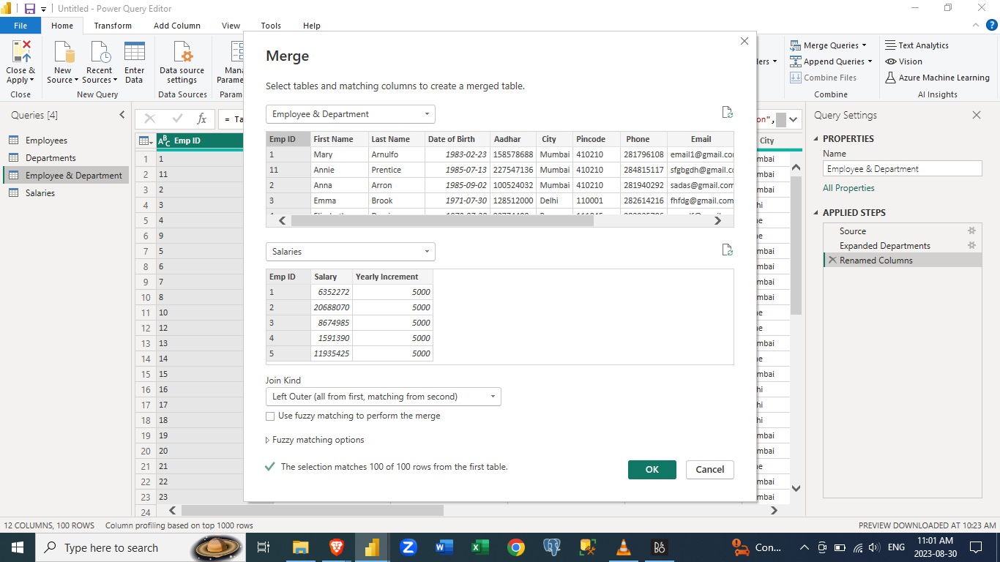

19. Merge the Employee & Department table with the salary table and perform Left Outer Join as well, then click ok

20. The New merged table has been created, Now you have to expand the new table

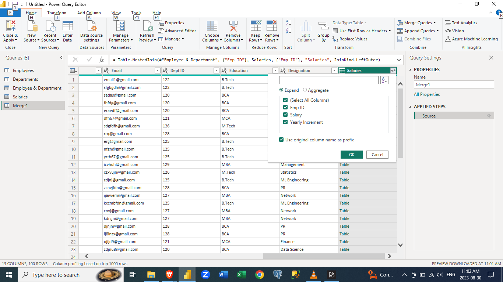

21. The new table is created and renamed Employee, Department & Salary.

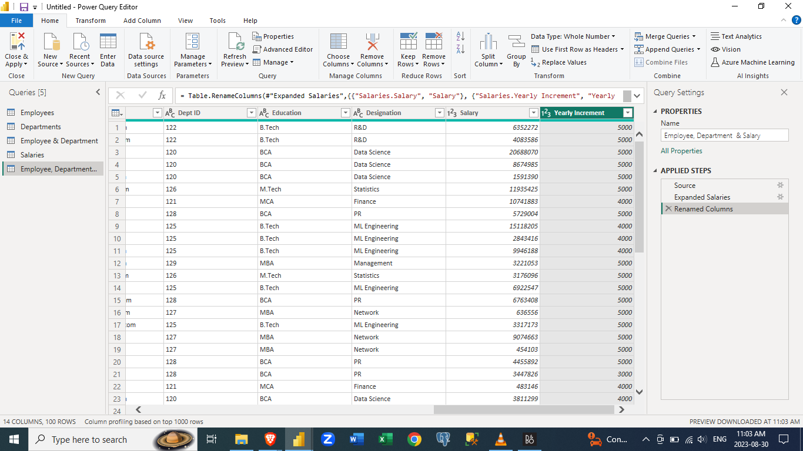

Note: The steps taken in the Power Query Editor are shown by the side under the Applied Steps column/section.

## Conclusion
Data cleaning is an essential skill for any data professional, and mastering it is crucial for generating meaningful and reliable insights. This repository serves as your go-to guide to conquering data cleaning challenges using Microsoft Power BI. By following the step-by-step instructions and applying the techniques covered, you'll be well-equipped to transform messy datasets into high-quality, actionable data that drives better decision-making.  

Learn how to become a Microsoft Power BI data cleaning expert by browsing the sections, learning from the hands-on examples, and navigating your way through the examples. Happy data cleaning!

