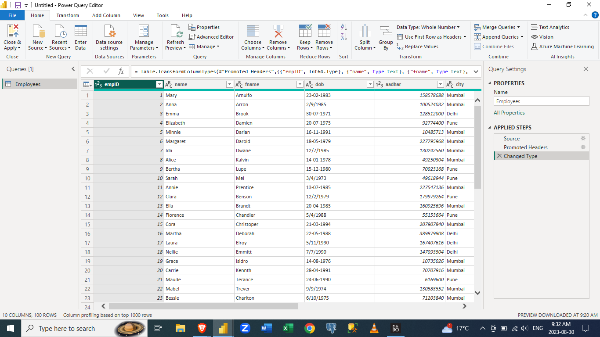
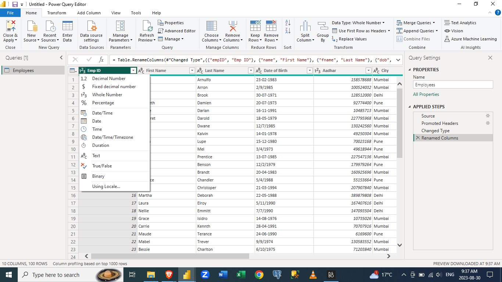

# -Mastering-Data-Cleaning-in-Microsoft-Power-BI-Step-by-Step-Guide-
Explore step-by-step instructions, best practices, and hands-on examples to transform raw data into clean, structured insights using the powerful tools and features of Microsoft Power BI. Whether you're a beginner or an experienced user, this repository empowers you to enhance your data quality.

## Introduction
This repository provides comprehensive information for becoming a Power BI data cleaning expert. The step-by-step guide will explain how to turn messy, raw data into clean, accurate and ready-to-analyze datasets. If you're new to data cleaning or a seasoned pro, this repository will provide you with the skills you need to confidently tackle data cleaning challenges.

## Problem Statement
Data cleaning is a critical phase in the data analysis process, but it can be time-consuming and challenging. Messy datasets, missing values, inconsistencies, and formatting issues can hinder accurate insights. With this project, we will provide a systematic approach to cleaning data within Microsoft Power BI. From handling missing data to standardizing formats, you'll learn how to effectively deal with common data quality issues.

## Analysis:
In this repository, we'll cover a wide range of data-cleaning techniques using Microsoft Power BI's capabilities. You'll discover how to:
1. Identify and handle missing data using various methods like imputation and removal.
2. Deal with inconsistencies in categorical data through grouping and renaming.
3. Detect and handle duplicate records to ensure data accuracy.
4. Transform and reshape data structures to fit your analytical needs.

The following steps are used to load clean files into the Power BI Desktop. Note, that we can import various types of data files into Power BI.  We are just going to use a .csv file first.  

1. Open your Microsoft Power Desktop.

2. Then click on Get Data, then this dialogue box appears.

3. 
